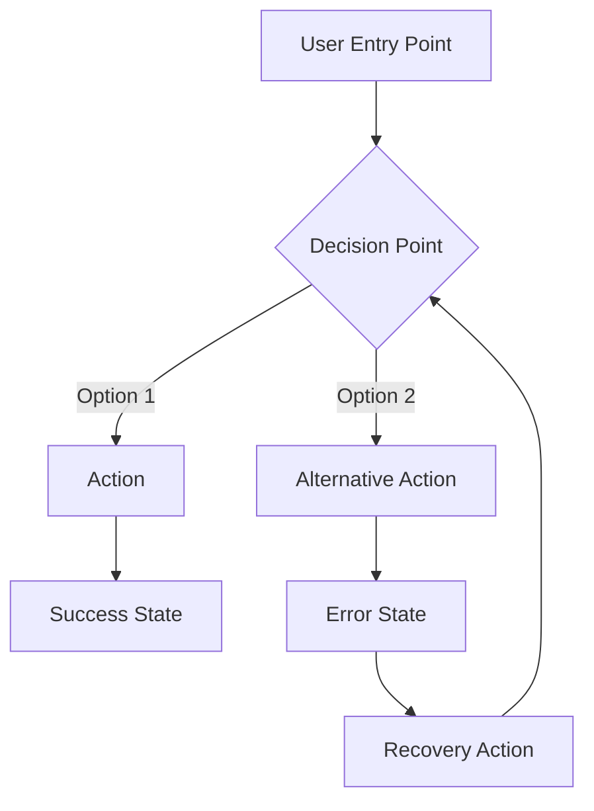

# Product Design Standards

> **MAINTENANCE:** This file is indexed in `pm-team/skills/shared-patterns/standards-coverage-table.md`.
> When adding/removing `## ` sections, follow FOUR-FILE UPDATE RULE in CLAUDE.md: (1) edit standards file, (2) update TOC, (3) update standards-coverage-table.md, (4) update agent file.

This file defines the standards for product design, UX research, and design specifications in the pre-development workflow.

> **Reference**: Always consult `docs/PROJECT_RULES.md` for common project standards.

---

## Table of Contents

| # | Section | Description |
|---|---------|-------------|
| 1 | [UX Research Methods](#ux-research-methods) | How to conduct user research |
| 2 | [Problem Validation](#problem-validation) | Validating user problems with evidence |
| 3 | [Persona Creation](#persona-creation) | Creating effective user personas |
| 4 | [Jobs to Be Done](#jobs-to-be-done) | JTBD framework for user needs |
| 5 | [User Flow Notation](#user-flow-notation) | Standard notation for user flows |
| 6 | [Wireframe Format](#wireframe-format) | YAML structure for wireframe specs |
| 7 | [ASCII Prototypes](#ascii-prototypes) | Visual layout notation for quick validation |
| 8 | [UI States](#ui-states) | Loading, error, empty, success states |
| 9 | [UX Acceptance Criteria](#ux-acceptance-criteria) | Format for UX criteria |
| 10 | [Accessibility Requirements](#accessibility-requirements) | WCAG compliance standards |
| 11 | [Responsive Design](#responsive-design) | Mobile-first guidelines |
| 12 | [Interaction Patterns](#interaction-patterns) | Standard UI interactions |
| 13 | [Forbidden Patterns](#forbidden-patterns) | Anti-patterns to avoid |

**Meta-sections (not checked by agents):**
- [Checklist](#checklist) - Self-verification before submitting design specs

---

## UX Research Methods

### Primary Research Methods

| Method | When to Use | Output |
|--------|-------------|--------|
| User Interviews | Understanding motivations, pain points | Interview notes, quotes |
| Surveys | Quantitative validation | Statistics, trends |
| Analytics Review | Understanding current behavior | Usage patterns, drop-off points |
| Competitor Analysis | Understanding market standards | Benchmark report |
| Usability Testing | Validating designs | Test results, recommendations |

### Research Documentation Format

```markdown
## Research Finding: [Title]

### Source
- Method: [Interview/Survey/Analytics/Competitor Analysis]
- Sample size: [N users/responses]
- Date: [When conducted]

### Key Insight
[One sentence summary]

### Evidence
- [Quote or data point 1]
- [Quote or data point 2]

### Implications for Design
- [How this affects our design decisions]
```

### Research Depth by Feature Type

| Feature Type | Research Depth | Methods |
|--------------|----------------|---------|
| New Product | Deep | Interviews + Surveys + Competitor Analysis |
| Major Feature | Medium | Interviews + Analytics |
| Enhancement | Light | Analytics + Quick Validation |
| Bug Fix | Minimal | Analytics only |

---

## Problem Validation

### Problem Statement Format

```markdown
## Problem Statement

### Who
[Target user persona or segment]

### What
[The specific problem they face]

### When
[The context/situation when this problem occurs]

### Impact
[Quantifiable impact: time lost, money lost, frustration level]

### Evidence
- [Data point 1]
- [User quote 1]
- [Metric showing problem severity]
```

### Validation Checklist

- [ ] Problem affects a measurable number of users
- [ ] Problem has quantifiable impact (time, money, satisfaction)
- [ ] Users have attempted workarounds (proves pain is real)
- [ ] Problem is not already solved by existing features
- [ ] Solving this problem aligns with product strategy

### Problem Severity Matrix

| Severity | Frequency | User Impact | Business Impact |
|----------|-----------|-------------|-----------------|
| **Critical** | Daily | Blocks core task | Revenue loss |
| **High** | Weekly | Significant friction | User churn risk |
| **Medium** | Monthly | Moderate inconvenience | NPS impact |
| **Low** | Rarely | Minor annoyance | Minimal |

---

## Persona Creation

### Persona Template

```markdown
## Persona: [Name]

### Demographics
- Role: [Job title or role]
- Experience: [Years in role, technical proficiency]
- Context: [Company size, industry]

### Goals
1. [Primary goal]
2. [Secondary goal]
3. [Tertiary goal]

### Pain Points
1. [Main frustration]
2. [Secondary frustration]

### Behaviors
- [How they currently solve this problem]
- [Tools they use]
- [Frequency of task]

### Quote
> "[A representative quote that captures their mindset]"

### Scenario
[A brief story of how they would encounter and use this feature]
```

### Persona Requirements

| Requirement | Description |
|-------------|-------------|
| Evidence-based | Based on real user research, not assumptions |
| Specific | Concrete details, not generic descriptions |
| Actionable | Directly informs design decisions |
| Limited | 3-5 personas maximum per product |

---

## Jobs to Be Done

### JTBD Statement Format

```
When [situation], I want to [motivation], so I can [expected outcome].
```

### JTBD Template

```markdown
## Job: [Short Name]

### Job Statement
When [specific situation/trigger],
I want to [action/motivation],
so I can [desired outcome/benefit].

### Functional Aspects
- [What the user needs to accomplish]

### Emotional Aspects
- [How the user wants to feel]

### Social Aspects
- [How the user wants to be perceived]

### Current Solutions
- [How users currently solve this]

### Switching Triggers
- [What would make users switch to our solution]
```

### Job Prioritization

| Priority | Criteria |
|----------|----------|
| **Must Have** | Core job, no alternative solution exists |
| **Should Have** | Important job, current solutions are painful |
| **Could Have** | Nice to have, improves experience |
| **Won't Have** | Out of scope for this iteration |

---

## User Flow Notation

### Mermaid Flowchart Standard



### Node Types

| Shape | Meaning | Example |
|-------|---------|---------|
| `[Text]` | Action/Screen | `[Login Form]` |
| `{Text}` | Decision | `{Valid credentials?}` |
| `([Text])` | Start/End | `([User arrives])` |
| `[[Text]]` | Sub-process | `[[Authentication Flow]]` |
| `[(Text)]` | Database | `[(User Data)]` |

### Flow Documentation Format

```markdown
## Flow: [Flow Name]

### Entry Points
- [How user enters this flow]

### Happy Path
1. User [action]
2. System [response]
3. User [action]
4. System [success state]

### Alternative Paths
- **If [condition]:** [alternative flow]
- **If [error]:** [error handling]

### Exit Points
- Success: [where user goes on success]
- Failure: [where user goes on failure]
- Abandon: [what happens if user leaves]

### Diagram
[Mermaid flowchart]
```

---

## Wireframe Format

### YAML Wireframe Specification

```yaml
screen: [Screen Name]
route: /path/to/screen
layout: [centered-card | full-width | sidebar | dashboard]

meta:
  title: "[Page Title]"
  description: "[Page description for SEO/accessibility]"

components:
  - type: heading
    text: "[Heading text]"
    level: 1  # 1-6

  - type: text
    content: "[Paragraph text]"
    variant: body | caption | label

  - type: button
    label: "[Button text]"
    variant: primary | secondary | outline | ghost | destructive
    icon: [icon-name]  # optional
    action: [action-name]

  - type: button-group
    direction: horizontal | vertical
    buttons:
      - label: "[Button 1]"
        variant: primary
      - label: "[Button 2]"
        variant: outline

  - type: input
    label: "[Field label]"
    placeholder: "[Placeholder text]"
    type: text | email | password | number | date
    required: true | false
    validation: "[Validation rule description]"

  - type: select
    label: "[Select label]"
    options:
      - value: option1
        label: "Option 1"
      - value: option2
        label: "Option 2"

  - type: checkbox
    label: "[Checkbox label]"
    description: "[Helper text]"

  - type: card
    title: "[Card title]"
    content: "[Card content]"
    actions:
      - label: "[Action]"
        variant: primary

  - type: table
    columns:
      - key: name
        label: "Name"
        sortable: true
      - key: status
        label: "Status"
    data_source: "[API endpoint or state key]"

  - type: divider
    text: "[Optional divider text]"

  - type: alert
    variant: info | success | warning | error
    title: "[Alert title]"
    message: "[Alert message]"

  - type: modal
    trigger: "[What opens this modal]"
    title: "[Modal title]"
    content:
      - type: text
        content: "[Modal content]"
    actions:
      - label: "Confirm"
        variant: primary
      - label: "Cancel"
        variant: outline

states:
  loading:
    description: "[What shows while loading]"
    components:
      - type: skeleton
        variant: [card | table | form]

  empty:
    description: "[What shows when no data]"
    components:
      - type: empty-state
        icon: [icon-name]
        title: "[Empty title]"
        description: "[Empty description]"
        action:
          label: "[CTA text]"
          href: /path

  error:
    description: "[What shows on error]"
    components:
      - type: alert
        variant: error
        title: "Error"
        message: "[Error message]"
        action:
          label: "Retry"

  success:
    description: "[What shows on success]"
    components:
      - type: toast
        variant: success
        message: "[Success message]"
```

### Wireframe File Structure

```
wireframes/
├── index.md              # Overview and navigation
├── auth/
│   ├── login.yaml
│   ├── register.yaml
│   └── forgot-password.yaml
├── dashboard/
│   ├── overview.yaml
│   └── settings.yaml
└── feature-name/
    ├── list.yaml
    ├── detail.yaml
    └── create.yaml
```

---

## ASCII Prototypes

### Purpose

ASCII prototypes provide a **quick visual representation** of the layout before implementation. They serve as:

1. **Communication tool** - Developers instantly understand spatial relationships
2. **Validation checkpoint** - Stakeholders can approve layout before code
3. **Design system alignment** - Forces explicit component decisions early

### ASCII Notation Reference

| Symbol | Meaning | Example |
|--------|---------|---------|
| `┌─┐` `└─┘` `│` | Container/card borders | Layout boundaries |
| `[ Button ]` | Button with label | `[ Save ]` `[ Cancel ]` |
| `[____]` | Text input field | `[_email@example.com_]` |
| `[▼ Select ]` | Dropdown/select | `[▼ Choose option ]` |
| `[ ○ ]` `[ ● ]` | Radio buttons | Unselected/selected |
| `[ ]` `[✓]` | Checkboxes | Unchecked/checked |
| `═══` | Table header separator | Below column headers |
| `───` | Table row separator | Between rows |
| `│` | Table column separator | Between columns |
| `✎` | Edit action icon | Action column |
| `🗑` | Delete action icon | Action column |
| `(link)` | Hyperlink text | `(Ver detalhes)` |
| `...` | Loading/skeleton | Content placeholder |
| `⚠` | Warning/alert indicator | Error states |
| `ℹ` | Info indicator | Helper text |

### ASCII Prototype Format

Every wireframe MUST include an ASCII prototype section:

```yaml
# In wireframe YAML file
screen: Account List
route: /accounts

ascii_prototype: |
  ┌────────────────────────────────────────────────┐
  │  Contas Bancárias                   [ + Nova ] │
  ├────────────────────────────────────────────────┤
  │                                                │
  │  ┌──────────────────────────────────────────┐  │
  │  │ Nome       │ Banco  │ Agência │ Ações    │  │
  │  │════════════│════════│═════════│══════════│  │
  │  │ Principal  │ Itaú   │ 1234    │  ✎  🗑   │  │
  │  │────────────│────────│─────────│──────────│  │
  │  │ Reserva    │ Nubank │ 0001    │  ✎  🗑   │  │
  │  └──────────────────────────────────────────┘  │
  │                                                │
  └────────────────────────────────────────────────┘

components:
  # ... YAML component definitions ...
```

### Layout Patterns

#### Pattern 1: List View with Actions

```
┌─────────────────────────────────────────────────┐
│  Page Title                        [ Action ]   │
├─────────────────────────────────────────────────┤
│                                                 │
│  ┌───────────────────────────────────────────┐  │
│  │ Col 1    │ Col 2    │ Col 3    │ Actions  │  │
│  │══════════│══════════│══════════│══════════│  │
│  │ Data     │ Data     │ Data     │  ✎  🗑   │  │
│  │──────────│──────────│──────────│──────────│  │
│  │ Data     │ Data     │ Data     │  ✎  🗑   │  │
│  └───────────────────────────────────────────┘  │
│                                                 │
│  ◀ 1 2 3 ... 10 ▶                              │
│                                                 │
└─────────────────────────────────────────────────┘
```

#### Pattern 2: Form Dialog/Modal

```
┌─────────────────────────────────────────────────┐
│  Modal Title                              [×]   │
├─────────────────────────────────────────────────┤
│                                                 │
│  Field Label                                    │
│  [________________________________]             │
│                                                 │
│  Field Label                                    │
│  [________________________________]             │
│                                                 │
│  Field Label                                    │
│  [▼ Select option                  ]            │
│                                                 │
├─────────────────────────────────────────────────┤
│                    [ Cancel ]    [ Confirm ]    │
└─────────────────────────────────────────────────┘
```

#### Pattern 3: Empty State

```
┌─────────────────────────────────────────────────┐
│  Page Title                        [ Action ]   │
├─────────────────────────────────────────────────┤
│                                                 │
│              ┌─────────────────┐                │
│              │                 │                │
│              │    [  icon  ]   │                │
│              │                 │                │
│              │  No items yet   │                │
│              │                 │                │
│              │  [ + Add First ]│                │
│              │                 │                │
│              └─────────────────┘                │
│                                                 │
└─────────────────────────────────────────────────┘
```

#### Pattern 4: Dashboard Cards

```
┌─────────────────────────────────────────────────┐
│  Dashboard                                      │
├─────────────────────────────────────────────────┤
│                                                 │
│  ┌───────────┐  ┌───────────┐  ┌───────────┐   │
│  │  Metric 1 │  │  Metric 2 │  │  Metric 3 │   │
│  │           │  │           │  │           │   │
│  │   1,234   │  │   5,678   │  │   $9,012  │   │
│  │   +12%    │  │   -5%     │  │   +8%     │   │
│  └───────────┘  └───────────┘  └───────────┘   │
│                                                 │
│  ┌───────────────────────────────────────────┐  │
│  │  Recent Activity                          │  │
│  │───────────────────────────────────────────│  │
│  │  • Item 1 - 2 min ago                     │  │
│  │  • Item 2 - 1 hour ago                    │  │
│  │  • Item 3 - Yesterday                     │  │
│  └───────────────────────────────────────────┘  │
│                                                 │
└─────────────────────────────────────────────────┘
```

#### Pattern 5: Confirmation Dialog

```
┌─────────────────────────────────────────────────┐
│  ⚠ Confirm Delete                        [×]   │
├─────────────────────────────────────────────────┤
│                                                 │
│  Are you sure you want to delete "Item Name"?  │
│                                                 │
│  This action cannot be undone.                 │
│                                                 │
├─────────────────────────────────────────────────┤
│                    [ Cancel ]    [ Delete ]     │
└─────────────────────────────────────────────────┘
```

### State Variations

Every ASCII prototype MUST show all UI states:

```yaml
ascii_prototype:
  default: |
    # Normal state with data
    ...

  loading: |
    # Loading state with skeletons
    ┌─────────────────────────────────────────┐
    │  Page Title                             │
    ├─────────────────────────────────────────┤
    │  ░░░░░░░░░░  │  ░░░░░░  │  ░░░░░░░░░   │
    │  ░░░░░░░░░░  │  ░░░░░░  │  ░░░░░░░░░   │
    │  ░░░░░░░░░░  │  ░░░░░░  │  ░░░░░░░░░   │
    └─────────────────────────────────────────┘

  empty: |
    # Empty state
    ...

  error: |
    # Error state
    ┌─────────────────────────────────────────┐
    │  ⚠ Error loading data                   │
    │     [ Retry ]                           │
    └─────────────────────────────────────────┘
```

### Responsive Variations

Include ASCII for key breakpoints when layout changes significantly:

```yaml
ascii_prototype:
  desktop: |
    ┌──────────────────────────────────────────────┐
    │  Sidebar │      Main Content Area           │
    │  ─────── │  ┌────────┐ ┌────────┐ ┌────────┐│
    │  Nav 1   │  │ Card 1 │ │ Card 2 │ │ Card 3 ││
    │  Nav 2   │  └────────┘ └────────┘ └────────┘│
    │  Nav 3   │                                  │
    └──────────────────────────────────────────────┘

  mobile: |
    ┌────────────────────┐
    │  ☰  App Title      │
    ├────────────────────┤
    │  ┌──────────────┐  │
    │  │   Card 1     │  │
    │  └──────────────┘  │
    │  ┌──────────────┐  │
    │  │   Card 2     │  │
    │  └──────────────┘  │
    │  ┌──────────────┐  │
    │  │   Card 3     │  │
    │  └──────────────┘  │
    └────────────────────┘
```

### Validation Rules

| Rule | Requirement |
|------|-------------|
| **Every wireframe** | MUST have at least one ASCII prototype |
| **UI components** | MUST match YAML component definitions |
| **Actions** | MUST show button labels, not just icons |
| **States** | MUST show at least default + empty states |
| **Responsive** | MUST show mobile layout if significantly different |

---

## UI States

### Required States for Every Interactive Element

| State | When | Required Elements |
|-------|------|-------------------|
| **Default** | Initial load | Content, clear affordances |
| **Loading** | Awaiting data | Skeleton or spinner, disable interactions |
| **Empty** | No data exists | Message, illustration, primary CTA |
| **Error** | Operation failed | Error message, recovery action |
| **Success** | Operation completed | Confirmation, next step |
| **Disabled** | Action not available | Visual dimming, tooltip explaining why |

### State Documentation Format

```markdown
## States: [Component/Screen Name]

### Loading State
- **Trigger:** [What causes loading]
- **Duration:** [Expected duration]
- **Visual:** [Skeleton/Spinner/Progress]
- **Interaction:** [What's disabled]

### Empty State
- **Trigger:** [When shown]
- **Message:** "[User-friendly message]"
- **CTA:** "[Primary action to resolve]"
- **Illustration:** [Yes/No, description]

### Error State
- **Trigger:** [What causes error]
- **Message:** "[User-friendly error message]"
- **Recovery:** "[How user can fix]"
- **Fallback:** "[What happens if unrecoverable]"

### Success State
- **Trigger:** [What causes success]
- **Feedback:** [Toast/Inline/Redirect]
- **Next Step:** "[What user should do next]"
```

---

## UX Acceptance Criteria

### Criteria Template

```markdown
# UX Acceptance Criteria

## Feature: [Feature Name]

## Functional Criteria
- [ ] User can complete [primary action] in [X] steps or fewer
- [ ] All form fields have visible labels
- [ ] All actions provide immediate visual feedback
- [ ] Error messages explain what went wrong and how to fix it
- [ ] Success states confirm what was accomplished

## Usability Criteria
- [ ] Primary action is visually prominent
- [ ] Navigation is consistent with existing patterns
- [ ] User can undo destructive actions or sees confirmation
- [ ] Loading states appear within 100ms of action
- [ ] Interactive elements have adequate touch targets (44x44px minimum)

## Accessibility Criteria
- [ ] All functionality is keyboard accessible
- [ ] Focus order follows logical reading order
- [ ] Color is not the only indicator of state
- [ ] Contrast ratios meet WCAG AA (4.5:1 text, 3:1 UI)
- [ ] All images have alt text
- [ ] Form errors are announced to screen readers

## Responsive Criteria
- [ ] Layout adapts to mobile viewport (320px minimum)
- [ ] Touch targets are appropriately sized on mobile
- [ ] Content remains readable without horizontal scrolling
- [ ] Images scale appropriately

## Performance Criteria
- [ ] Initial content visible within 1.5s
- [ ] Interactive within 3s on 3G connection
- [ ] No layout shift after initial render
```

### Criteria Priority

| Priority | Type | Must Pass |
|----------|------|-----------|
| **P0** | Functional | 100% |
| **P1** | Usability + Accessibility | 100% |
| **P2** | Responsive | 90% |
| **P3** | Performance | Target metrics |

---

## Accessibility Requirements

### WCAG 2.1 AA Compliance

| Principle | Requirement | How to Verify |
|-----------|-------------|---------------|
| **Perceivable** | 4.5:1 contrast for text | Use contrast checker |
| **Perceivable** | Alt text on images | Inspect img elements |
| **Operable** | Keyboard navigation | Tab through UI |
| **Operable** | 44x44px touch targets | Measure interactive elements |
| **Understandable** | Error identification | Trigger errors, check messages |
| **Robust** | Valid HTML | Run HTML validator |

### Accessibility Checklist

```markdown
## Accessibility Checklist

### Keyboard Navigation
- [ ] All interactive elements are focusable
- [ ] Focus indicator is visible
- [ ] Tab order is logical
- [ ] Escape closes modals/dropdowns
- [ ] Enter/Space activates buttons

### Screen Readers
- [ ] Headings follow hierarchy (h1 > h2 > h3)
- [ ] Buttons have accessible names
- [ ] Form inputs have labels
- [ ] Status changes are announced
- [ ] Images have alt text

### Visual
- [ ] Text contrast >= 4.5:1
- [ ] UI element contrast >= 3:1
- [ ] Color not sole indicator
- [ ] Text resizable to 200%
- [ ] No horizontal scroll at 320px
```

---

## Responsive Design

### Breakpoints

| Breakpoint | Width | Target Devices |
|------------|-------|----------------|
| `xs` | < 640px | Mobile portrait |
| `sm` | >= 640px | Mobile landscape, small tablets |
| `md` | >= 768px | Tablets |
| `lg` | >= 1024px | Laptops |
| `xl` | >= 1280px | Desktops |
| `2xl` | >= 1536px | Large desktops |

### Mobile-First Principles

1. **Content Priority:** Most important content first
2. **Touch Targets:** Minimum 44x44px
3. **Thumb Zone:** Primary actions in comfortable reach
4. **Single Column:** Default to stacked layout
5. **Progressive Enhancement:** Add complexity for larger screens

### Responsive Documentation

```markdown
## Responsive Behavior: [Component Name]

### Mobile (< 768px)
- Layout: [Stack/Single column]
- Hidden: [What's hidden]
- Navigation: [How nav works]

### Tablet (768px - 1024px)
- Layout: [Two column/Grid]
- Changes: [What changes]

### Desktop (> 1024px)
- Layout: [Full layout]
- Additions: [What's added]
```

---

## Interaction Patterns

### Standard Interactions

| Interaction | Trigger | Response | Duration |
|-------------|---------|----------|----------|
| Button click | Click/Enter | Visual feedback + action | Immediate |
| Form submit | Submit button | Loading state + result | Variable |
| Link hover | Mouse hover | Underline/color change | Immediate |
| Input focus | Focus event | Border highlight | Immediate |
| Dropdown open | Click | Expand with animation | 150-200ms |
| Modal open | Trigger click | Fade in + backdrop | 200-300ms |
| Toast appear | System event | Slide in | 200ms |
| Toast dismiss | Auto/manual | Slide out | 200ms |

### Animation Guidelines

| Type | Duration | Easing |
|------|----------|--------|
| Micro (hover, focus) | 100-150ms | ease-out |
| Small (dropdowns, tooltips) | 150-200ms | ease-out |
| Medium (modals, panels) | 200-300ms | ease-in-out |
| Large (page transitions) | 300-500ms | ease-in-out |

### Feedback Patterns

| Action | Feedback Type | Example |
|--------|---------------|---------|
| Success | Toast + state change | "Saved successfully" |
| Error | Inline message + toast | Form field error |
| Loading | Spinner/skeleton | Button loading state |
| Progress | Progress bar | File upload |
| Confirmation | Modal | Delete confirmation |

---

## Forbidden Patterns

### UX Anti-Patterns

| Anti-Pattern | Why It's Bad | Alternative |
|--------------|--------------|-------------|
| **Dark patterns** | Manipulative, unethical | Honest, clear design |
| **Mystery meat navigation** | Unclear purpose | Labeled navigation |
| **Infinite scroll without position** | User loses place | Show position, "back to top" |
| **Auto-playing media** | Disruptive, accessibility issue | User-initiated playback |
| **Tiny touch targets** | Frustrating on mobile | 44x44px minimum |
| **Color-only status** | Inaccessible | Icons + text + color |
| **Confirmation without consequence** | Users ignore warnings | Contextual warnings |
| **Hidden required fields** | Form frustration | Show all required upfront |

### Design Debt

| Type | Description | Resolution |
|------|-------------|------------|
| **Inconsistent components** | Same function, different UI | Standardize to DS |
| **Orphan states** | Missing loading/error/empty | Add all states |
| **Non-responsive** | Desktop-only design | Mobile-first redesign |
| **Inaccessible** | WCAG violations | Accessibility audit |

---

## Checklist

### Before Submitting Design Specs

```markdown
## Pre-Submission Checklist

### Research
- [ ] Problem is validated with evidence
- [ ] Personas are based on real user data
- [ ] Jobs to be done are documented

### Flows
- [ ] Happy path is documented
- [ ] Error paths are documented
- [ ] Edge cases are identified

### Wireframes
- [ ] All screens have wireframe specs
- [ ] All states (loading, error, empty, success) are defined
- [ ] Responsive behavior is documented

### Criteria
- [ ] UX acceptance criteria are complete
- [ ] Accessibility requirements are specified
- [ ] Performance targets are defined

### Handoff Ready
- [ ] Design system components are identified
- [ ] Missing components are flagged
- [ ] Developer questions are anticipated
```
